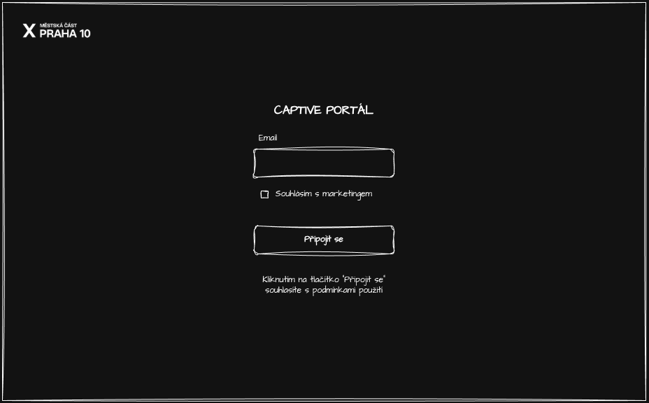
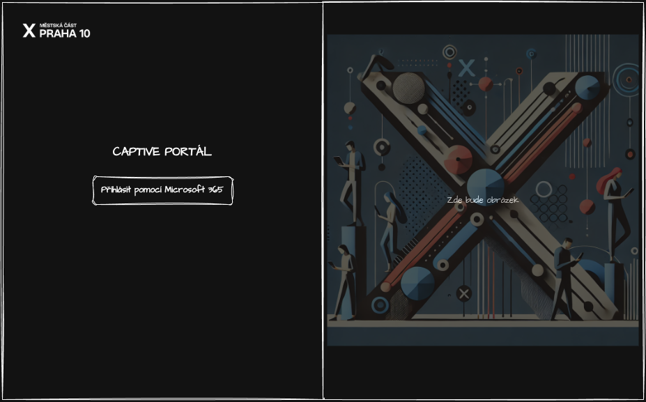

# User stories

Definice základních user stories pro správné zadání k vývoji aplikace

## Obsah

1. [Připojení ke captive](#připojení-ke-captive)
1. [Přihlášení jako administrátor](#přihlášení-jako-administrátor)
1. [Šablona user-story](#šablona-user-story)

## Připojení ke captive

Já jako uživatel chci možnost přihlášení pomocí captive-portálu, abych mohl přistoupit k veřejné wifi síti.

### Akceptační kritéria

1. Uživatel bude zadávat emailovou adresu, ta musí splňovat základní validační pravidla
1. Uživatel bude mít možnost zaškrtnout zda souhlasí s marketingovými informacemi

### Technické poznámky

Uživatel bude po připojení k WiFi síti přesměrovaný routerem na captive-portál. Router uživatele přesměřuje pomocí HTTP Redirect 301 a do URL parametrů automatický vloží základní údaje.

Vzor HTTP Redirect 

``` text
HTTP/2 301 - Redirect
location: /?post=http://192.168.30.1:1000/fgtauth&magic=040d028c9aaae999&usermac=60:03:08:8f:5e:b6&apmac=08:5b:0e:08:d4:ee&apip=192.168.30.41&ssid=test&apname=FWF60D4613003326&bssid=00:00:00:00:00:00
content-type: text/plain; charset=utf-8
```

URL Query parametry:

``` json
{
   "post": "http://192.168.30.1:1000/fgtauth", //URL na kterou se bude zasílat POST
   "magic": "040d028c9aaae999", // Speciální klíč generovaný pro každého uživatele
   "usermac": "60:03:08:8f:5e:b6", // MAC adresa, kterou se připojuje uživatel
   "apmac": "08:5b:0e:08:d4:ee", // Adresa přístupového bodu, pomocí kterého se připojil
   "apip": "192.168.30.41", // --||--
   "ssid": "test", // Název sítě, pomocí které se uživatel připojil
   "apname": "FWF60D4613003326", // Název přístupového bodu
   "bssid": "00:00:00:00:00:00", // Netuším...
}
```

### Mockup / Wireframes


---

## Přihlášení jako administrátor

Já jako administrátor chci možnost přihlášení pomocí Mirosoft 365, abych mohl bezpečně spravovat a prohlížet stránky a data, které captive portál ukládá

### Akceptační kritéria

Uživatel musí mít možnost se přihlásit pomocí M365 účtu

Uživatel nemůže zobrazit `/admin` stránky bez toho, aniž by byl přihlášený

Pokud uživatel nebude přihlášený a bude chtít zobrazit `/admin` stránku, bude přesměrovaný na `/login` stránku

### Technické poznámky

Uživatel se bude přihlašovat pomocí OAuth přihlášení M365. Uživatel nejdříve otevře stránku `/login` a poté pomocí tlačítka `Přihlásit pomocí Microsoft 365` bude přesměrovaný na Microsoft přihlášení. Po úspěšném přihlášení ho Microsoft opět odešle na `/admin` stránku.

Je potřeba zabezpečit stránky tak, aby se na ně nebylo možné prokliknout bez toho, aniž by byl uživatel přihlášený.

Používat budeme knihovnu **Auth.js**, která je kompatibilní s Next.js

### Mockup / Wireframes



---


# Šablona user-story

## Název user story

> stručný popis user-story například: <br>
> Já jako [Typ uživatele] chci [funkcionalitu], abych [proč] <br>
> Já jako uživatel chci možnost přihlášení pomocí captive-portálu, abych mohl přistoupit k veřejné wifi

### Akceptační kritéria

> Podmínky, které musí být splněné, aby byla user-story považována za hotovou

> Může obsahovat například vstupní parametry pro formuláře, očekavané hodnoty apod.

### Technické poznámky

> Může obsahovat různé poznámky od integrace s API, datovou strukturu a jiné další důležitá data.

### Mockup / Wireframes

> Obrázky, návhrhy dat, případně wireframe stránky / komponenty

---